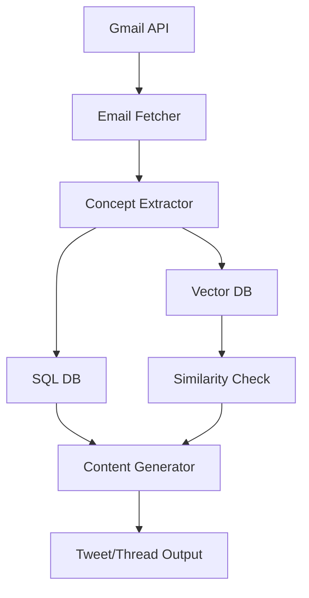

# Echo - Technical Overview

## Architecture

Echo is a sophisticated system designed to streamline content generation from email newsletters through a multi-stage pipeline:

1. **Email Processing & Concept Extraction**
   - Integrates with Gmail API to fetch newsletters
   - Uses LLMs to extract key concepts from email content
   - Implements similarity checking (threshold: 0.85) to prevent concept duplication
   - Stores concepts in both SQLite (metadata) and Chroma (vector embeddings)

2. **Database Structure**
   - SQLite for relational data:
     - `emails`: Stores raw email data and processing status
     - `concepts`: Manages extracted concepts with metadata
     - `email_concepts`: Maps relationships between emails and concepts
   - ChromaDB for semantic search:
     - Stores concept embeddings for similarity detection
     - Enables semantic search for related concepts

3. **Content Generation**
   - Multiple LLM Options:
     - OpenAI models (gpt-4o, gpt-4o-mini)
     - DeepSeek model (deepseek-v3)
   - Generation Types:
     - Single tweets (< 280 chars)
     - Thread generation (3-10 tweets)
   - Context Enhancement:
     - Incorporates similar concepts
     - Extracts and includes article content from links
     - Supports custom instructions

## Technical Features

1. **Smart Concept Management**
   - Automatic deduplication using vector similarity
   - Concept usage tracking
   - Reference counting for popularity metrics
   - Link extraction and preview generation

2. **LLM Integration**
   - Modular prompt system
   - Structured output using Pydantic models
   - Error handling and retry mechanisms
   - API key management for multiple providers

3. **Web Interface**
   - Built with Streamlit
   - Multi-page architecture
   - Session state management
   - Real-time content preview
   - Responsive grid layout

## Data Flow

## Dependencies
- `langchain`: LLM orchestration
- `chromadb`: Vector storage
- `streamlit`: Web interface
- `goose3`: Article extraction
- `sqlite3`: Relational database
- `pydantic`: Data validation
